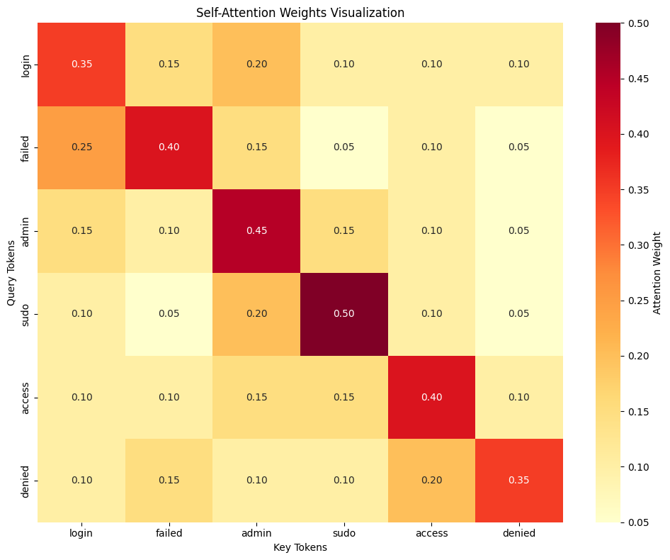
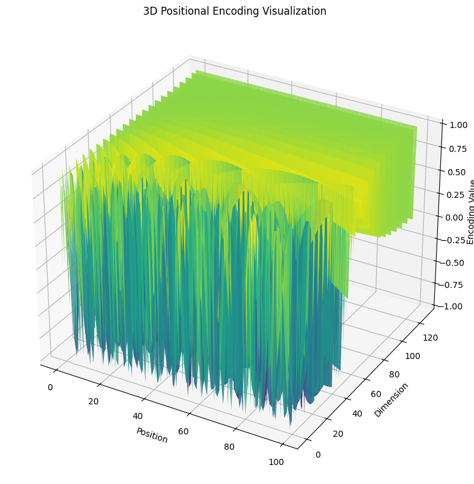
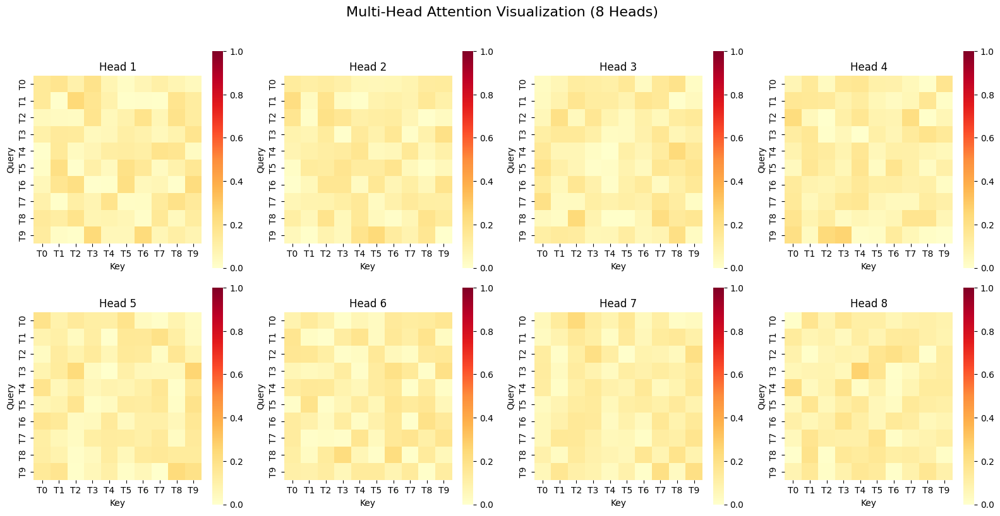

```python
Final Exam - AI ML
```


```python
Mikheil Davidovi
```


```python
TASK 2: Transformer Networks
```


```python
# Transformer Networks and Applications in Cybersecurity
```


```python
## Overview
```


```python
Transformer networks, introduced in the groundbreaking paper "Attention is All You Need" (Vaswani et al., 2017), 
have revolutionized natural language processing and are increasingly being applied to cybersecurity tasks. Unlike 
recurrent neural networks (RNNs), transformers process entire sequences in parallel using self-attention mechanisms, 
making them highly efficient and capable of capturing long-range dependencies.
```


```python
## Core Architecture
```


```python
### 1. Self-Attention Mechanism
```


```python
The self-attention mechanism allows the model to weigh the importance of different parts of the input sequence when 
processing each element. For each position in the sequence, attention computes three vectors: Query (Q), Key (K), 
and Value (V).

**Attention Formula:**
```
Attention(Q, K, V) = softmax(QK^T / √d_k) V
```

Where:
- Q, K, V are query, key, and value matrices
- d_k is the dimension of the key vectors
- The division by √d_k prevents gradients from becoming too small
```


```python
### 2. Multi-Head Attention
```


```python
Instead of performing a single attention function, transformers use multiple attention "heads" that learn different 
representations of the input. The outputs are concatenated and linearly transformed.
```


```python
### 3. Positional Encoding
```


```python
Since transformers process sequences in parallel (unlike RNNs), they need a way to incorporate positional information. 
Positional encodings are added to the input embeddings using sine and cosine functions of different frequencies:
```
PE(pos, 2i) = sin(pos / 10000^(2i/d_model))
PE(pos, 2i+1) = cos(pos / 10000^(2i/d_model))
```
```


```python
### 4. Feed-Forward Networks
```


```python
Each transformer layer contains a position-wise feed-forward network applied to each position separately and identically.
```


```python
### 5. Layer Normalization and Residual Connections
```


```python
These components help stabilize training and enable the network to learn deeper representations.

```


```python
## Architecture Diagram
```


```python
Input Sequence
      ↓
Input Embedding + Positional Encoding
      ↓
┌─────────────────────────┐
│  Encoder Block (Nx)     │
│  ┌──────────────────┐   │
│  │ Multi-Head       │   │
│  │ Self-Attention   │   │
│  └──────────────────┘   │
│          ↓              │
│  ┌──────────────────┐   │
│  │ Feed Forward     │   │
│  │ Network          │   │
│  └──────────────────┘   │
└─────────────────────────┘
      ↓
Output / Classification
```


```python
## Applications in Cybersecurity
```


```python
### 1. Malware Detection and Classification
```


```python
Transformers can analyze sequences of API calls, system events, or instruction sequences to identify malicious behavior 
patterns. They excel at understanding the context and relationships between different operations.
```


```python
### 2. Network Intrusion Detection
```


```python
By processing network traffic as sequences of packets or events, transformers can detect anomalous patterns indicative of 
attacks such as DDoS, port scanning, or data exfiltration.
```


```python
### 3. Log Analysis and Anomaly Detection
```


```python
Security logs contain sequential events that transformers can analyze to identify suspicious activities, correlate events 
across different systems, and detect advanced persistent threats (APTs).
```


```python
### 4. Phishing Detection
```


```python
Transformers power advanced language models that can analyze email content, URLs, and website text to detect phishing 
attempts with high accuracy.
```


```python
### 5. Vulnerability Analysis
```


```python
Code analysis using transformers can identify potential security vulnerabilities by understanding code structure and 
patterns associated with common weaknesses.
```


```python
### 6. Threat Intelligence
```


```python
Transformers process security reports, threat feeds, and indicators of compromise (IOCs) to extract actionable intelligence 
and predict emerging threats.
```


```python
## Attention Mechanism Visualization
```


```python
import numpy as np
import matplotlib.pyplot as plt
import seaborn as sns

def plot_attention_weights(attention_weights, tokens):
    """
    Visualize attention weights as a heatmap
    
    Args:
        attention_weights: numpy array of shape (seq_len, seq_len)
        tokens: list of token strings
    """
    plt.figure(figsize=(10, 8))
    sns.heatmap(attention_weights, 
                xticklabels=tokens,
                yticklabels=tokens,
                cmap='YlOrRd',
                annot=True,
                fmt='.2f',
                cbar_kws={'label': 'Attention Weight'})
    plt.xlabel('Key Tokens')
    plt.ylabel('Query Tokens')
    plt.title('Self-Attention Weights Visualization')
    plt.tight_layout()
    plt.savefig('attention_heatmap.png', dpi=300, bbox_inches='tight')
    plt.show()

# Example: Cybersecurity log analysis
log_tokens = ['login', 'failed', 'admin', 'sudo', 'access', 'denied']

# Simulated attention weights (in practice, these come from the model)
attention_weights = np.array([
    [0.35, 0.15, 0.20, 0.10, 0.10, 0.10],
    [0.25, 0.40, 0.15, 0.05, 0.10, 0.05],
    [0.15, 0.10, 0.45, 0.15, 0.10, 0.05],
    [0.10, 0.05, 0.20, 0.50, 0.10, 0.05],
    [0.10, 0.10, 0.15, 0.15, 0.40, 0.10],
    [0.10, 0.15, 0.10, 0.10, 0.20, 0.35]
])

plot_attention_weights(attention_weights, log_tokens)
```


    

    


```python
## Positional Encoding Visualization
```


```python
import numpy as np
import matplotlib.pyplot as plt


def get_positional_encoding(seq_len, d_model):
    """
    Generate positional encoding

    Args:
        seq_len: sequence length
        d_model: embedding dimension

    Returns:
        numpy array of shape (seq_len, d_model)
    """
    position = np.arange(seq_len)[:, np.newaxis]
    div_term = np.exp(np.arange(0, d_model, 2) * -(np.log(10000.0) / d_model))

    pos_encoding = np.zeros((seq_len, d_model))
    pos_encoding[:, 0::2] = np.sin(position * div_term)
    pos_encoding[:, 1::2] = np.cos(position * div_term)

    return pos_encoding


def visualize_positional_encoding(seq_len=100, d_model=128):
    """Visualize positional encoding patterns"""
    pos_encoding = get_positional_encoding(seq_len, d_model)

    fig, (ax1, ax2) = plt.subplots(1, 2, figsize=(16, 6))

    # Heatmap of positional encodings
    im1 = ax1.imshow(pos_encoding.T, cmap='RdBu', aspect='auto')
    ax1.set_xlabel('Position in Sequence')
    ax1.set_ylabel('Embedding Dimension')
    ax1.set_title('Positional Encoding Heatmap')
    plt.colorbar(im1, ax=ax1)

    # Specific positions
    positions_to_plot = [0, 10, 20, 40, 60, 80]
    for pos in positions_to_plot:
        ax2.plot(pos_encoding[pos, :50], label=f'Position {pos}')

    ax2.set_xlabel('Embedding Dimension')
    ax2.set_ylabel('Encoding Value')
    ax2.set_title('Positional Encoding for Different Positions')
    ax2.legend()
    ax2.grid(True, alpha=0.3)

    plt.tight_layout()
    plt.savefig('positional_encoding.png', dpi=300, bbox_inches='tight')
    plt.show()

    # 3D visualization
    fig = plt.figure(figsize=(12, 8))
    ax = fig.add_subplot(111, projection='3d')

    positions = np.arange(seq_len)
    dimensions = np.arange(d_model)
    X, Y = np.meshgrid(positions, dimensions)

    ax.plot_surface(X, Y, pos_encoding.T, cmap='viridis', alpha=0.8)
    ax.set_xlabel('Position')
    ax.set_ylabel('Dimension')
    ax.set_zlabel('Encoding Value')
    ax.set_title('3D Positional Encoding Visualization')

    plt.tight_layout()
    plt.savefig('positional_encoding_3d.png', dpi=300, bbox_inches='tight')
    plt.show()


# Generate visualizations
visualize_positional_encoding(seq_len=100, d_model=128)
```


    

    


    

    


```python
## Multi-Head Attention Visualization
```


```python
import numpy as np
import matplotlib.pyplot as plt
import seaborn as sns
import math

def visualize_multihead_attention(num_heads=8, seq_len=10):
    """Visualize multiple attention heads"""

    tokens = [f'T{i}' for i in range(seq_len)]

    cols = min(4, num_heads)
    rows = math.ceil(num_heads / cols)

    fig, axes = plt.subplots(rows, cols, figsize=(4 * cols, 4 * rows))
    axes = np.array(axes).reshape(-1)  # flatten safely

    for head in range(num_heads):
        # Generate random attention weights (demo purpose)
        attention = np.random.rand(seq_len, seq_len)
        attention = attention / attention.sum(axis=1, keepdims=True)

        sns.heatmap(
            attention,
            xticklabels=tokens,
            yticklabels=tokens,
            cmap="YlOrRd",
            ax=axes[head],
            cbar=True,
            square=True,
            vmin=0,
            vmax=1
        )

        axes[head].set_title(f"Head {head + 1}")
        axes[head].set_xlabel("Key")
        axes[head].set_ylabel("Query")

    for i in range(num_heads, len(axes)):
        axes[i].axis("off")

    plt.suptitle(
        f"Multi-Head Attention Visualization ({num_heads} Heads)",
        fontsize=16,
        y=1.02
    )

    plt.tight_layout()
    plt.savefig("multihead_attention.png", dpi=300, bbox_inches="tight")
    plt.show()


# Run visualization
visualize_multihead_attention(num_heads=8, seq_len=10)
```


    

    


```python
## Advantages in Cybersecurity
```


```python
1. Long-Range Dependencies: Transformers can correlate events that are far apart in time or sequence
2. Parallel Processing: Faster training and inference compared to RNNs
3. Context Understanding: Better comprehension of attack patterns and tactics
4. Transfer Learning: Pre-trained models can be fine-tuned for specific security tasks
5. Interpretability: Attention weights provide insights into which parts of the input are important
```


```python
## Conclusion
```


```python
Transformer networks represent a paradigm shift in sequence modeling with powerful applications in cybersecurity. Their 
ability to process long sequences, capture complex dependencies, and provide interpretable attention patterns makes them 
invaluable for tasks ranging from malware detection to threat intelligence analysis. As cybersecurity threats become more 
sophisticated, transformers offer the architectural flexibility and performance needed to stay ahead of adversaries.
```
