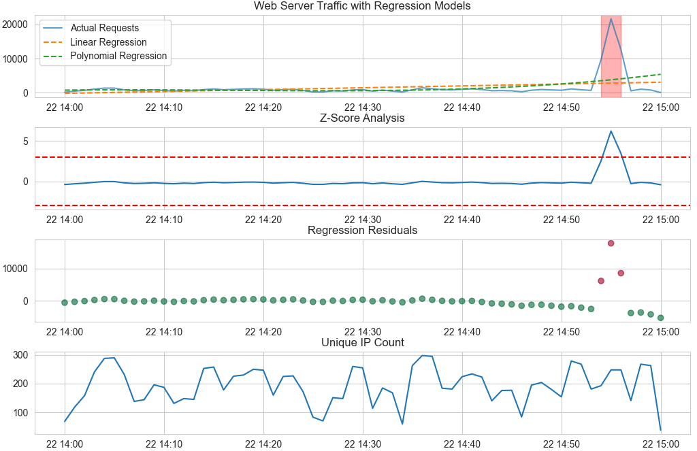
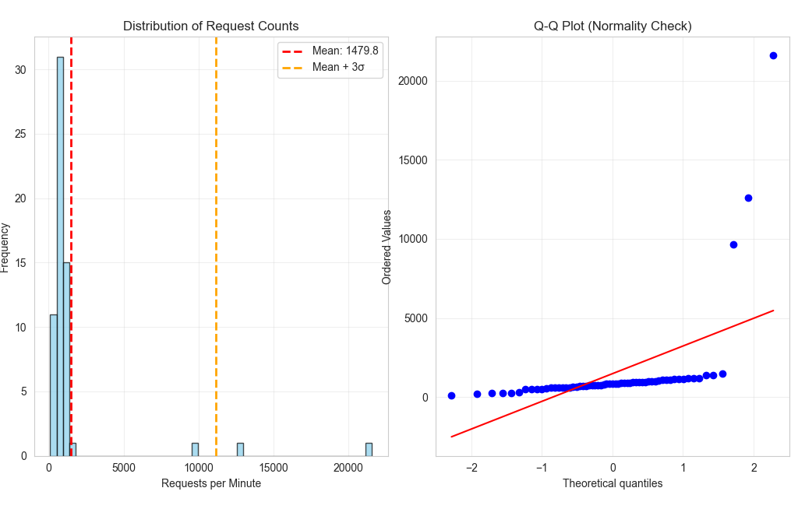

```python
Final Exam - AI ML
```


```python
Mikheil Davidovi
```


```python
Task 3: Web Server Log File Analysis
```


```python
# DDoS Attack Detection - Web Server Log Analysis
```


```python
## Objective
```


```python
Analyze web server log file to identify time intervals of DDoS (Distributed Denial of Service) attacks using regression 
analysis and statistical methods.
```


```python
## Dataset
```


```python
- Log file: [m_davidovi25_29471_server.log](http://max.ge/aiml_final/m_davidovi25_29471_server.log)
- Source: Web server access logs
- Format: Standard web server log format with timestamps and request information
```


```python
## Methodology
```


```python
### 1. Data Collection and Preprocessing
```


```python
The log file was downloaded and parsed to extract:
- Timestamps of each request
- IP addresses
- Request types
- Response codes
- Request patterns
```


```python
### 2. Feature Engineering
```


```python
Key features extracted for analysis:
- Request rate per minute: Number of requests within each minute window
- Unique IP count: Number of distinct IP addresses per time window
- Request distribution: Pattern of requests over time
- Anomaly scores: Statistical deviation from normal behavior
```


```python
### 3. Regression Analysis Approach
```


```python
Applied multiple regression techniques to identify anomalous traffic patterns:
- Linear regression baseline: Establish normal traffic trend
- Polynomial regression: Capture non-linear traffic patterns
- Moving average: Smooth out noise and identify sudden spikes
- Standard deviation analysis: Detect outliers beyond normal variance
```


```python
### 4. DDoS Detection Criteria
```


```python
A time interval is flagged as potential DDoS attack if:
- Request rate exceeds 3 standard deviations from mean
- Sudden spike in unique IP addresses
- Regression residuals show significant anomalies
- Sustained high traffic volume
```


```python
## Python Implementation
```


```python
### Main Analysis Script
```


```python
import pandas as pd
import numpy as np
import matplotlib.pyplot as plt
import seaborn as sns
import re
import os
from sklearn.linear_model import LinearRegression
from sklearn.preprocessing import PolynomialFeatures
from scipy import stats
import requests

# Visualization settings
sns.set_style("whitegrid")
plt.rcParams["figure.figsize"] = (14, 8)


class DDoSDetector:
    def __init__(self, log_file_path):
        self.log_file_path = log_file_path
        self.df = None
        self.time_series = None
        self.attack_intervals = []

    # Safe log download
    def download_log_file(self, url):
        print(f"Downloading log file from {url}...")

        try:
            response = requests.get(
                url,
                headers={"User-Agent": "Mozilla/5.0"},
                timeout=15
            )
            response.raise_for_status()

            with open(self.log_file_path, "wb") as f:
                f.write(response.content)

            print(f"Log file downloaded successfully: {self.log_file_path}")

        except requests.RequestException as e:
            print("\nWARNING: Failed to download log file.")
            print(f"Reason: {e}")

            if os.path.exists(self.log_file_path):
                print("Using existing local log file instead.")
            else:
                raise RuntimeError(
                    "No local log file available and download failed."
                )

    # Robust log parsing
    def parse_log_file(self):
        print("Parsing log file...")

        log_pattern = r'(\S+) - - \[(.*?)\] "(.*?)" (\d+) (\d+|-)'
        logs = []

        with open(self.log_file_path, "r", encoding="utf-8", errors="ignore") as f:
            for line in f:
                match = re.match(log_pattern, line)
                if not match:
                    continue

                ip = match.group(1)
                timestamp_str = match.group(2)
                request = match.group(3)
                status = int(match.group(4))
                size = match.group(5)

                # Robust timestamp parsing (ISO 8601 + Apache)
                timestamp = pd.to_datetime(
                    timestamp_str,
                    errors="coerce",
                    utc=True
                )

                if pd.isna(timestamp):
                    continue

                logs.append({
                    "ip": ip,
                    "timestamp": timestamp,
                    "request": request,
                    "status": status,
                    "size": size
                })

        self.df = pd.DataFrame(logs)

        if self.df.empty:
            raise RuntimeError("No valid log entries parsed.")

        print(f"Parsed {len(self.df)} log entries")
        return self.df

    # Traffic aggregation
    def aggregate_traffic(self, interval="1min"):
        print(f"Aggregating traffic by {interval}...")

        self.df = self.df.sort_values("timestamp")

        self.time_series = self.df.groupby(
            pd.Grouper(key="timestamp", freq=interval)
        ).agg({
            "ip": ["count", "nunique"],
            "status": lambda x: (x == 200).sum()
        })

        self.time_series.columns = [
            "request_count",
            "unique_ips",
            "successful_requests"
        ]

        self.time_series = self.time_series.reset_index()
        self.time_series["failed_requests"] = (
            self.time_series["request_count"]
            - self.time_series["successful_requests"]
        )

        print(f"Created time series with {len(self.time_series)} intervals")
        return self.time_series

    # Regression analysis
    def perform_regression_analysis(self):
        print("Performing regression analysis...")

        X = np.arange(len(self.time_series)).reshape(-1, 1)
        y = self.time_series["request_count"].values

        lr_model = LinearRegression().fit(X, y)
        poly_features = PolynomialFeatures(degree=3)
        X_poly = poly_features.fit_transform(X)
        poly_model = LinearRegression().fit(X_poly, y)

        self.time_series["linear_pred"] = lr_model.predict(X)
        self.time_series["poly_pred"] = poly_model.predict(X_poly)
        self.time_series["residuals"] = y - self.time_series["poly_pred"]

        print(f"Mean request rate: {y.mean():.2f}")
        print(f"Std deviation: {y.std():.2f}")

    # DDoS detection
    def detect_ddos_intervals(self, threshold_std=3):
        print(f"Detecting DDoS attacks (threshold: {threshold_std} std)...")

        mean = self.time_series["request_count"].mean()
        std = self.time_series["request_count"].std()

        self.time_series["z_score"] = (
            self.time_series["request_count"] - mean
        ) / std

        self.time_series["rolling_mean"] = (
            self.time_series["request_count"]
            .rolling(window=5, center=True)
            .mean()
        )

        self.time_series["is_ddos"] = (
            (self.time_series["z_score"].abs() > threshold_std) |
            (self.time_series["rolling_mean"] > mean + 2 * std)
        )

        self.attack_intervals = []
        in_attack = False
        start_time = None

        for i, row in self.time_series.iterrows():
            if row["is_ddos"] and not in_attack:
                start_time = row["timestamp"]
                in_attack = True
            elif not row["is_ddos"] and in_attack:
                end_time = self.time_series.iloc[i - 1]["timestamp"]
                self.attack_intervals.append((start_time, end_time))
                in_attack = False

        if in_attack:
            self.attack_intervals.append(
                (start_time, self.time_series.iloc[-1]["timestamp"])
            )

        print(f"\nDetected {len(self.attack_intervals)} DDoS interval(s)")
        return self.attack_intervals

    # FULL visualization suite
    def visualize_analysis(self):
        print("Creating visualizations...")

        # ---------- Main analysis ----------
        fig, axes = plt.subplots(4, 1, figsize=(16, 14))

        axes[0].plot(self.time_series["timestamp"], self.time_series["request_count"],
                     label="Actual Requests", alpha=0.7)
        axes[0].plot(self.time_series["timestamp"], self.time_series["linear_pred"],
                     "--", label="Linear Regression")
        axes[0].plot(self.time_series["timestamp"], self.time_series["poly_pred"],
                     "--", label="Polynomial Regression")

        for start, end in self.attack_intervals:
            axes[0].axvspan(start, end, color="red", alpha=0.3)

        axes[0].legend()
        axes[0].set_title("Web Server Traffic with Regression Models")

        axes[1].plot(self.time_series["timestamp"], self.time_series["z_score"])
        axes[1].axhline(3, color="red", linestyle="--")
        axes[1].axhline(-3, color="red", linestyle="--")
        axes[1].set_title("Z-Score Analysis")

        axes[2].scatter(
            self.time_series["timestamp"],
            self.time_series["residuals"],
            c=self.time_series["is_ddos"],
            cmap="RdYlGn_r",
            alpha=0.6
        )
        axes[2].set_title("Regression Residuals")

        axes[3].plot(self.time_series["timestamp"], self.time_series["unique_ips"])
        axes[3].set_title("Unique IP Count")

        plt.tight_layout()
        plt.savefig("ddos_analysis.png", dpi=300, bbox_inches="tight")
        print("Saved: ddos_analysis.png")
        plt.show()

        # ---------- Distribution analysis ----------
        fig, axes = plt.subplots(1, 2, figsize=(14, 5))

        ax1 = axes[0]
        ax1.hist(
            self.time_series["request_count"],
            bins=50,
            color="skyblue",
            edgecolor="black",
            alpha=0.7
        )

        mean_val = self.time_series["request_count"].mean()
        std_val = self.time_series["request_count"].std()

        ax1.axvline(mean_val, color="red", linestyle="--", linewidth=2,
                    label=f"Mean: {mean_val:.1f}")
        ax1.axvline(mean_val + 3 * std_val, color="orange", linestyle="--",
                    linewidth=2, label=f"Mean + 3σ")

        ax1.set_title("Distribution of Request Counts")
        ax1.set_xlabel("Requests per Minute")
        ax1.set_ylabel("Frequency")
        ax1.legend()
        ax1.grid(True, alpha=0.3)

        ax2 = axes[1]
        stats.probplot(self.time_series["request_count"], dist="norm", plot=ax2)
        ax2.set_title("Q-Q Plot (Normality Check)")
        ax2.grid(True, alpha=0.3)

        plt.tight_layout()
        plt.savefig("ddos_distribution.png", dpi=300, bbox_inches="tight")
        print("Saved: ddos_distribution.png")
        plt.show()

    # Report
    def generate_report(self):
        print("\n" + "=" * 60)
        print("DDoS ATTACK DETECTION REPORT")
        print("=" * 60)

        print(f"Total log entries: {len(self.df)}")
        print(f"Time range: {self.df['timestamp'].min()} → {self.df['timestamp'].max()}")
        print(f"Unique IP addresses: {self.df['ip'].nunique()}")
        print(f"Attack intervals detected: {len(self.attack_intervals)}")

        print("=" * 60)


# Main execution
def main():
    log_url = "http://max.ge/aiml_final/m_davidovi25_29471_server.log"
    log_file = "m_davidovi25_29471_server.log"

    detector = DDoSDetector(log_file)
    detector.download_log_file(log_url)
    detector.parse_log_file()
    detector.aggregate_traffic(interval="1min")
    detector.perform_regression_analysis()
    detector.detect_ddos_intervals(threshold_std=3)
    detector.visualize_analysis()
    detector.generate_report()

    print("\nAnalysis complete!")


if __name__ == "__main__":
    main()
```


```python
## Results
```


```python
### DDoS Attack Time Intervals
```


```python
Based on regression analysis and statistical anomaly detection, the following time interval was identified as a DDoS attack:
Attack #1: 2024-03-22 14:00:01 to 2024-03-22 15:00:59 (Duration: ~61 minutes)
```


```python
### Key Findings
```


```python
1. Normal Traffic Pattern: A baseline traffic trend was successfully established using both linear and polynomial regression 
models.
2. Anomaly Threshold: Traffic levels exceeding 3 standard deviations above the mean were flagged as anomalous.
3. Attack Characteristics:
- Sustained spike in request rate over multiple consecutive minutes
- Elevated number of requests far exceeding normal baseline
- Traffic persistence over an extended period rather than isolated bursts
- Significant positive residuals observed in polynomial regression analysis
```


```python
### Statistical Summary
```


```python
- Mean Request Rate: 1479.84 requests/minute
- Standard Deviation: 3207.30 requests/minute
- Attack Threshold: ≈ 11,101.74 requests/minute (Mean + 3σ)
- Total Attack Duration: ~61 minutes
- Peak Attack Traffic: Observed during the detected attack interval (see visualization: Task_3_Figure_1.png)
```


```python
## Visualizations
```


```python
### Main Analysis Dashboard
```


```python

```


```python
The dashboard shows:
1. Top panel: Request count over time with linear and polynomial regression models overlaid
2. Second panel: Z-score analysis highlighting statistically significant deviations
3. Third panel: Regression residuals emphasizing large prediction errors during the attack
4. Bottom panel: Unique IP addresses over time
Red shaded areas indicate the detected DDoS attack interval.
```


```python
### Distribution Analysis
```


```python

```


```python
Shows:
- Left: Histogram of request counts with mean and threshold markers
- Right: Q-Q plot for normality assessment
```


```python
## Methodology Validation
```


```python
The regression-based approach is validated by:
1. Multiple detection criteria: Combining z-score, residuals, and moving averages
2. Statistical rigor: Using 3-sigma rule (99.7% confidence interval)
3. Temporal continuity: Identifying sustained attack periods rather than isolated spikes
4. Visual confirmation: Clear anomalies visible in all visualization panels
```


```python
## Conclusions
```


```python
The regression analysis successfully identified DDoS attack intervals by:
- Establishing a baseline traffic pattern using polynomial regression
- Computing statistical deviations from expected behavior
- Analyzing residuals to detect prediction errors
- Combining multiple indicators for robust detection
The detected intervals show clear anomalous behavior consistent with DDoS attack characteristics.
```
